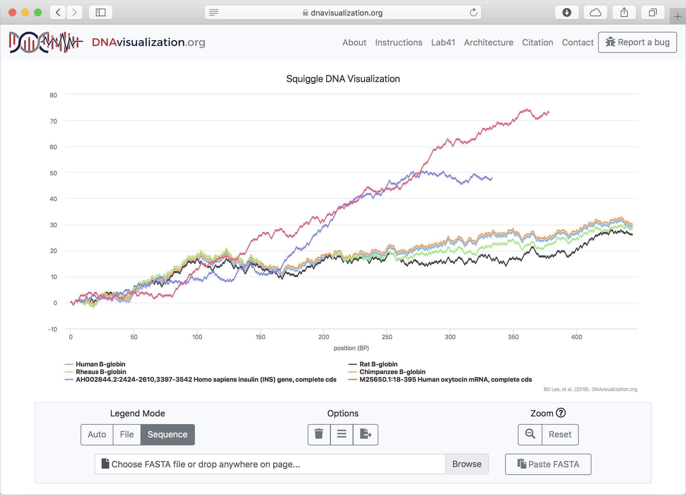
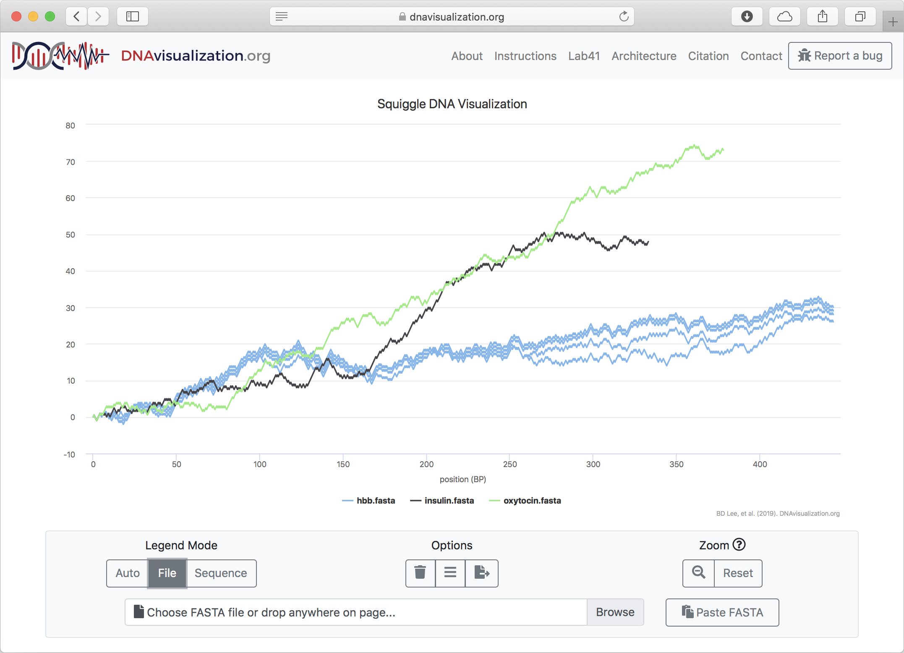

# Abstract

Raw DNA sequences contain an immense amount of meaningful biological information.
However, these sequences are hard for humans to intuitively interpret.
To solve this problem, a number of methods have been proposed to transform DNA sequences into two-dimensional visualizations.
DNAvisualization.org implements several of these methods in a cost effective and high-performance manner via a novel, entirely serverless architecture.
By taking advantage of recent advances in serverless parallel computing and selective data retrieval, the website is able to offer users the ability to visualize up to thirty 4.5 Mbp DNA sequences simultaneously in seconds using one of five supported methods.

# Introduction

As DNA sequencing technology becomes more commonplace, tools for the analysis of its data are among the most cited papers in science [@wrenBioinformaticsProgramsAre2016].
The reason is simple: DNA sequences are, by themselves, almost completely unintelligible to humans.
Seeing meaningful patterns in DNA sequences (which are often too large to be shown in their entirety on a screen) is a significant challenge for researchers.
One approach to addressing this problem is to convert DNA sequences into two-dimensional visualizations that capture some part of the biological information contained within the sequences.
This has the benefit of taking advantage of the highly developed human visual system, which is capable of tremendous feats of pattern recognition and memory [@bradyVisualLongtermMemory2008].

A variety of methods have been proposed to convert DNA sequences into two dimensional visualizations [@randicCompact2DGraphical2003; @qiUsingHuffmanCoding2011; @guoNumericalCharacterizationDNA2003; @yauDNASequenceRepresentation2003; @gatesSimpleWayLook1986; @zou2DGraphicalRepresentation2014; @jeffreyChaosGameRepresentation1990; @pengLongrangeCorrelationsNucleotide1992; @leeSquiggleUserfriendlyTwodimensional2018; @bariEffectiveEncodingDNA2013].
These methods are highly heterogenous, but, for the sake of this paper, we will only discuss methods with no degeneracy, _i.e._ methods that produce visualizations which may be unambiguously transformed back into the DNA sequence from which they were generated.
All of these methods share a single feature: they map each nucleotide in a DNA sequence to one or more points in the Cartesian plane.

One effect of mapping each base to at least one point is that the number of points grows linearly with the length of the DNA sequence.
This poses a technological challenge, as the technology to sequence DNA has vastly outpaced tools to visualize it.
Indeed, there is currently a dearth of DNA visualization tools capable of implementing the variety of methods that have been introduced in the literature [@thomasGraphDNAJavaProgram2007; @arakawaGenomeProjectorZoomable2009; @leeSquiggleUserfriendlyTwodimensional2018].
Taking inspiration from DNAsonification.org [@templeAuditoryDisplayTool2017], which allows for the auditory inspection of DNA sequences, we propose DNAvisualization.org to fill this gap in the web-based visualization toolset.

# Methods

## Interface

The user interface for the tool is deliberately simple.
A user first selects a visualization method from one of the five currently supported methods [@yauDNASequenceRepresentation2003;@gatesSimpleWayLook1986;@leeSquiggleUserfriendlyTwodimensional2018;@qiNovel2DGraphical2007] and then provides FASTA-formatted sequence data to visualize, either by using the operating system's file input prompt, dragging-and-dropping files onto the window, pasting files, clicking a button to load example data, or pasting the raw data into a text prompt.
Upon receipt of sequence data, a loading spinner indicates that the system is processing the data.
After the data processing is complete, the loading spinner is replaced with the two-dimensional visualization.

The initial view is such that the entirety of each sequence's visualization is visible: every part of every sequence can be seen.
This poses an immediate challenge, as comparing sequences of vastly different lengths will result in the smaller sequence being so small as to be essentially invisible.
To solve this problem, the tool allows users to toggle the visibility of sequences by clicking on the corresponding legend entry, which will automatically rescale the visualization's axes to fit the displayed sequences.
The legend coloring is dynamic as well.
The user may decide to color code the legend either with each sequence (shown in +@fig:sequence-mode) or each file in its own color (shown in +@fig:file-mode) and toggle between options after the data has been plotted, allowing for both inter- and intra-file comparisons.

To inspect a region of the visualization more closely, a user may click and drag over it to zoom in.
When zooming in, a more detailed visualization is shown by asynchronously retrieving data for the region, allowing for base-pair resolution analysis.
With a single click, the axis scaling may be reset to the default zoom level.

The title and subtitle of the visualization are dynamically set but may be overridden at any time by the user.
If the user wishes, their visualization may be downloaded in one of several formats suitable for publication such as SVG, PDF, JPG, and PNG.

{#fig:sequence-mode width=100%}

{#fig:file-mode width=100%}

DNAvisualization.org supports color coding each sequence or file individually.

## Implementation

The web tool is built using a novel entirely serverless architecture, with computing as well as data storage and selective retrieval done in a serverless manner.
To understand how this system differs from a traditional architecture, consider a traditional approach to building the DNAvisualization.org tool.
A server, usually running Linux or Microsoft Windows, is established to handle HTTP requests to the website.
This server is either maintained by a university or, increasingly often, a cloud services provider.
If there are no requests (as can be expected to be a significant fraction of the time for most websites), the server sits idle.
When requests are submitted, the server responds to each one.
If the server is at capacity, requests may wait unanswered or, with additional complexity, more servers may be automatically requested from cloud services provider to meet the greater demand.
Data storage is usually provided by a relational database management system (RDBMS), which must also be running on a server.

This paradigm has several disadvantages: disruptions to the server result in disruptions to the website, greater expertise is required for the development and maintenance of the website, the server wastes resources while sitting idle, and the server's computational and storage capacity is directly limited by its hardware.

To solve these problems, a new model has been introduced called serverless computing or Function-as-a-Service (FaaS).
The basic idea is that a software developer specifies code to be executed (_i.e._ a function) and then invokes it on varying inputs.
The cloud services provider is thereby delegated the responsibility for the execution of the code.
In this model, the pricing is by function invocation.
When not being used, there is no cost to the user.
On the other hand, if there are numerous simultaneous function invocations, each invocation is handled separately, in parallel.

By making the serverless function a virtual "server" that can handle a request and invoking the function upon each individual request, one is able to take full advantage of serverless computing.
For each request to the website, a virtual server is created for just long enough to respond to the request and then immediately extinguished.
This results in the website being able to instantly scale to use exactly the resources needed to meet demand.

DNAvisualization.org is built atop Amazon Web Services (AWS) due to their generous free tier that, at the time of this writing, allows for one million free function invocations per month using their Lambda serverless compute platform, which is anticipated to easily meet the demand for the site.
In the event that the free tier is exceeded, the AWS Lambda's pricing is very affordable.

For DNAvisualization.org, we use AWS Lambda to serverlessly transform submitted DNA sequences into their visualizations in parallel, in addition to serving the static assets (_i.e._ HTML, Javascript, and CSS files) to the user.
The site uses Python's Flask web framework and has its deployment to AWS Lambda seamlessly automated by the Zappa tool.

It must be noted that using a serverless architecture to host a website is not novel by itself.
Rather, the novelty of the architecture lies in its combination of serverless computing for request handling with query-in-place data retrieval.
As mentioned previously, a normal web architecture would use a server running a RDBMS to handle data storage.
In the case of DNA visualization, the database would be used to persist the transformed DNA sequences as $x$- and $y$-coordinates that may be queried when zooming in on a region.
However, using a database server creates many of the same issues as using a server for web hosting, such as scalability, cost, and parallelism.
Instead of using an RDBMS, we used the S3 cloud storage platform combined with the S3 Select query-in-place functionality offered by AWS.
In essence, this service allows one to upload a compressed tabular file to S3 and then submit a SQL query to be executed against the tabular data.
In this paradigm, pricing is based on the amount and duration of data storage, the amount of scanned during querying, and the amount of data returned by query.

For DNAvisualization.org, each submitted sequence's transformation is stored on AWS S3 in the open-source Apache Parquet tabular data format using Snappy columnar compression.
Then, when a user zooms in on a region, a request is sent to AWS Lambda, which submits a SQL query to S3 Select, which in turn scans the file for data in the region.
The matching data is then returned to the Lambda function, which downsamples the data if necessary (to prevent wasting users' memory with more data points than can be show) and returns it to the browser, which in turn updates the visualization.
This process happens entirely in parallel for each sequence the user has submitted, regardless of how much demand there is on the website, showcasing the usefulness of serverless computing. The S3 buckets (_i.e._ folders) containing the cached DNA transformations are configured such that twenty-four hours after a user has submitted a sequence for visualization, its transformation is automatically deleted, thereby further reducing the cost of the website's operation.

{#fig:architecture width=4.25in}

An overview of the architecture is presented in +@fig:architecture.

# Results and Discussion

## Performance

## Limitations

The primary limitation of this architecture is necessity for a short duration of computation (currently on the scale of seconds) or, failing that, the ability to parallelize the computation and the data.
In addition, memory constraints on the scale of megabytes to several gigabytes must also be respected.
Applications which violate these requirements will need significant modifications to this architecture in order to function.
As the capabilities of serverless computing increase, the burden of these limitations will decrease.
For more information about the limitations of serverless computing, see @hellersteinServerlessComputingOne2019.

These limitations were bypassed by this tool in several ways, which may be of interest to readers attempting to implement similar architectures in the future.
When implementing parallelization, we were faced with a choice between higher file-level parallelization (parsing and transforming each file's sequences in a separate Lambda function invocation) and lower sequence-level parallelization (parsing the files in the browser and invoking a Lambda function to transform each sequence individually).
We initially chose the former but quickly ran into memory issues, even when opting to use the most generous memory allocation available (3,008 MB at the time of writing [^1]).
To reduce memory demands, we switched to sequence-level parallelism and eliminated as many dependencies as possible.
As a result, sequences in length of up to 4.5 Mbp may be transformed for visualization in a single function invocation.
In the future, we aim to increase this limit by taking advantage of further optimizations in memory management during transformation and increases in the total available amount of memory available to function invocations.

# Conclusion

# Data Availability

The website is freely accessible at [https://DNAvisualization.org](https://dnavisualization.org).
The software repository is hosted at https://github.com/Benjamin-Lee/DNAvisualization.org.

# References

[^1]: This total includes all of the function's code as well as the data on which it is invoked.
